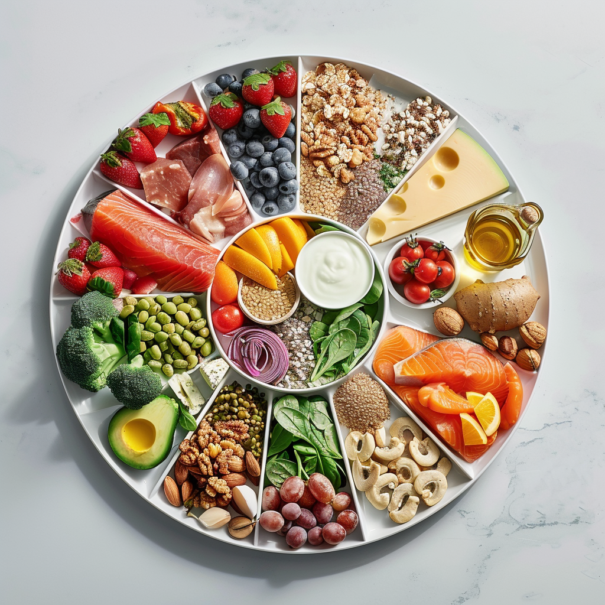

- The main functionality of my app is to take the users search (Food) and display the calorie count and fat content of that specific food item, so that the user can manage there health by watching the calories and fat intake
- There are two other small functionality's of the app:
    - Taking and displaying the users daily calorie limit
    - Informing why its important to have a healthy diet and providing a link to further information
 
- There are six functional buttons within the app, whith three of them being used three times each:
    - Home button takes you to the home screen, used three times on each page
    - Diet button takes you to the diet screen, used three times on each page
    - Nutrition button takes you to the nutrition screen, used three times on each page
    - Enter button for the users daily calorie limit, on home page
    - More Information button is an external link to the World Health Organisations website on healthy diets, on diet page
    - Search button thats for the users input in the food search bar, on the nutri page

- There is also two functional images in the app:
    - Home page image is a collection of mainly fruits, veg and a piece of salmon on a reflective surface
    - Diet page image is a bowl with a collection of different food items split into sections

- Video Link
    - https://youtu.be/GHpX9BoUJjE